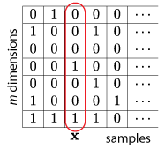

Bayesian Entropy estimator for binary vector observations
=========================================================

Estimating Shannon's entropy from data is difficult, especially when you have little data compared to the number of possible symbols.
However, if your data are in the form of binary vectors, you're in luck!
CDMentropy provides two state-of-the-art Bayesian entropy estimators for binary vector data.
CDMentropy was primiarily developed for estimating entropy of neural spike trains; however, if your data have a structure similar to that our prior assumes, it might work very well for you too.

CDM stands for to *Centered Dirichlet Mixture*, which is the prior for our Bayesian entropy estimator.
We center a Dirichlet distribution over all possible binary words around an independent Bernoulli (DBer) or a synchrony (DSyn) distribution.

This MATLAB code is a reference implementation for the results described in the following paper:

- Evan Archer, Il Memming Park, Jonathan
  W. Pillow. [Bayesian entropy estimation for binary spike train data using parametric prior knowledge. Neural Information Processing Systems](http://pillowlab.princeton.edu/pubs/abs_Archer_BDPentropy_NIPS13.html),
  (NIPS) 2013

Installation
------------
Downloading the source code from command line:

    $ git clone https://github.com/pillowlab/CDMentropy.git
    $ cd CDMentropy
    $ git submodule update --init # to pull the PYMentropy submodule

To compile the MEX code, run the following in MATLAB.

    >> makeMex

Use the `startup.m` script to add the relevant paths to MATLAB.
(If you start MATLAB in `CDMentropy` directory, MATLAB automatically loads `startup.m`.)

Quick example
-------------
Let's say that your observation is in the following matrix form:

Here, each row of your matrix corresponds to an `m` dimensional observation, or "word".
To estimate entropy of the first 7 observations, we simply call `computeH_CDM`.

    >> words = [...
	[0 1 0 0 0]; ...
	[1 0 0 1 0]; ...
	[0 0 0 0 0]; ...
	[0 0 1 0 0]; ...
	[0 0 0 1 0]; ...
	[1 0 0 0 1]; ...
	[1 1 1 1 0]; ...
    ];
    >> H = computeH_CDM(words)
    DSyn mode
    H =

	3.8495

`computeH_CDM` returns the estimated entropy in unit of *bits*.
Note that this data did not have any coincidence (every word was unique), however, our estimator gave a reasonable estimate based on the prior.

**Try `try_me.m` to see it in action!**

Options
-------
The 4th argument is the option structure.

- To turn off the verbose output:

    opts.verbose = false;

- To assume a DBer prior instead of DSyn prior

    opts.isDBer = true;

- To change the number integration grid points

    opts.nAlpha = 300;

- To change the precision of the entropy sampling

    opts.hPrecision = 1e-3;

See documentation of `computeH_CDM` for additional options.

Compact representation
----------------------
To estimate the entropy, we only need to know the histogram over the unique words, and corresponding number of 1's for the corresponding unique word.
This compact representation is memory efficient, and sufficient for CDM entropy estimation.
Use `words2nnOcnts` to convert to this representation.

    >> [nn ocnts] = words2nnOcnts(words); % compact representation
    >> m = size(words, 2); % get the dimension
    >> H = computeH_CDM(nn,ocnts,m) % estimate entropy

This would result in same result as above.

Variance
--------
If more than one return value are requested to `computeH_CDM`, it samples from the posterior and returns the variance, confidence intervals, and samples. Due to the sampling, it is significantly slower than just computing the mean.

    >> [H, Hvar] = computeH_CDM(nn,ocnts,m,struct('verbose', false))
    H =

	3.8495

    Hvar =

	0.1331

The samples themselves can be accessed via extra output arguments.
Consult documentation of `computeH_CDM` for more details.

Functions
---------
Here are list of potentially useful functions provided by CDMentropy and PYMentropy. For detailed information use `help function` or `doc function` in MATLAB.

Estimating entropy:
 - `computeH_CDM`: estimate entropy using centered-Dirichlet mixture prior
 - `computeH_PYM`: estimate entropy using Pitman-Yor mixture prior

Miscellaneous:
- `unit_test_CDM`: Unit test (run this if you doubt it's correctness)
- `dirichletrnd`: draw random samples from a Dirichlet distribution

Fast preprocessing of binary data:
- `discreteTimeSeries2Words`: convert n-ary vector sequence to unique symbols
- `fastWords2Counts`: convert n-ary vector sequence into counts

Following functions form compact representation of the data:
- `words2nnOcnts`
- `multiplicitiesFromCounts`
- `multiplicitiesFromSamples`
- `multiplicitiesToCounts`
- `words2multiplicities`

External links
==============
A closely related sister-paper also appeared at the same conference:

- Il Memming Park, Evan W. Archer, Kenneth Latimer, Jonathan W. Pillow. [Universal models for binary spike patterns using centered Dirichlet processes](http://papers.nips.cc/paper/5050-universal-models-for-binary-spike-patterns-using-centered-dirichlet-processes) NIPS 2013

In the above paper, centered Dirichlet processes are used to estimate the full distribution rather than the entropy. A different prior, the *cascaded logistic model*, is used there. Unfortunately, the cascaded logistic does not allow for fast entropy estimation.

CDMentropy code shares some code from the [PYMentropy](https://github.com/pillowlab/PYMentropy) project. The PYM entropy estimator is a generic discrete entropy estimator, not restricted to binary vector obsevations.
